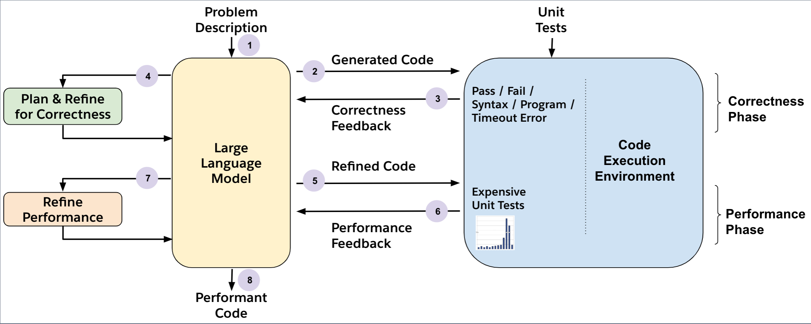

# PerfCodeGen

Official repository to replicate the setup and experiments from our work [PerfCodeGen: Improving Performance of LLM Generated Code with Execution Feedback](TODO).

Blogpost on PerfCodeGen: 



## Overview

### Goal
PerfCodeGen is a training-free framework designed to generate optimal code using LLMs for a given programming task that can be verified for correctness and efficiency by a suite of unit tests.

### Approach
We apply a straightforward strategy to optimise for performance of LLM generated code along with functional correctness in two phases: 
- Correctness phase: Given a task description, we first prompt the LLM to generate a candidate solution that is assessed (and self-refined on failure) for correctness by the LLM. 
- Performance refinement phase: After obtaining a functionally correct solution, we perform a self-refine round for runtime-efficiency and conduct a performance assessment using an execution environment to identify the expensive unit tests. The observations from this execution are then passed as verbalised performance feedback to the LLM to re-refine for efficiency.

### Key result 
- We show PerfCodeGen's execution feedback when paired with GPT-4 can generate code more optimal than the ground truth for more than half of HumanEval and MBPP tasks (~47% and ~56% respectively). 
- We prove the effectiveness of PerfCodeGen style execution feedback in improving the efficiency of code generated by LLMs of different sizes including Phi-3-mini, Mixtral-8x7B, Command R, Llama 3 8B, 70B, GPT-3.5 and GPT-4.

<!-- GPT-4 without execution feedback achieves optimisation for (39.26% and 43% respectively). -->

## Instructions to replicate PerfCodeGen

Requirements: Listed in the `src/requirements.txt` file. 

Key python scripts to replicate the experiments: `inference.py` used to generate program solutions from LLMs and `evaluate_prompt.py` used to evaluate the programs. PerfCodeGen alternates between LLM inference and program evaluation steps in each phase of (0) code generation, (1) refining for correctness and (2) refining for performance.

---
### 0. Base Code Generation Phase

#### 0.1 Inference: Use the API `infer_openai_model_prompts()` from `inference.py`.

Arguments:

```
model: set the model path where you store the huggingface model
mode: “base”
rd: 0
output_path: set the path where you want to store the results
sample_num: set the sample num, in our experiments this is set to 20.
batch: for open models, always set to True. For OpenAI models, set to True if you want to use the batch inference function of OpenAI, otherwise set to False. Note that setting to False will immediately begin the inference process and you will have to wait for quite a long time to finish.
batch_split: for open models, always set to False. for OpenAI models, always set to True. This is because a batch cannot contain more than 10,000 lines in batch inference of OpenAI.
```

Other arguments are not required in this phase and can be left to default. If your configuration is right and batch is set to True, this API will generate the batch input file for inference. For OpenAI models, use the API `upload_file()` to upload all the batch input files and record the identifiers of files. Then use the identifiers and the API `batch_run()` to run batch inference on the input files, this API will return the identifiers of sessions that run batch inference. Next OpenAI will run batch inference on your uploaded inputs and you have to wait until this process completes. You can use the API `batch_status()` with identifiers of sessions to query the status of batch inference. Once the status becomes complete, you can download the output file using the API `download_file()`. Note that you have to set the output path in the function body of `download_file()`.

For open-source models, use the API `batch_infer_local_chat_model()` to invoke local models for batch inference via vLLM.
The function arguments have the same meaning as the `infer_openai_model_prompts()` API. Remember to set the path of the generated batch input file under the argument input_file.
This API will start the regular inference process of open-source models and you need to wait for completion.

#### 0.2 Program Evaluation

After you get the batch output files from openai models or open-source models, you can perform evaluation on the results. The evaluation is conducted in the `evaluate_prompt.py` file.

0.2.1. Use the `write_batch_outputs()` to format the output results. The first argument should be the path to your output result file. The second argument should be the path to the file generated by `infer_openai_model_prompts()`. The third argument should be the path to the hash map file, which is under your output directory and created by `infer_openai_model_prompts()`.

0.2.2. Use `prepare_correctness_check()` to prepare the data for correctness check. It sanitizes the solutions and leaves syntax-correct solutions for check. The first argument is the mode (“base” in this phase), the second argument is the rd (0 in this phase), the third argument is the general file generated by `infer_openai_model_prompts()`, which is also the second argument in the above step. For the default argument `checked_file`, set it to the checked file of last round, if your round is 0, set to the last round of the last phase. If your round is 0 and the mode is “base”, leave it as default.

0.2.3. Use `run_correctness_check()` to run the correctness check. This requires multiple CPU pods for speedu completion. The first argument is a file ended with “_SOLUTIONS.json” generated in 0.2.2. The argument `task_num` is the total number of CPU pods you have, and you need to run this API on different pods by setting different `task_index`. `task_index` should begin with 0 and end with task_num-1.

0.2.4. Use `finalize_correctness_check()` to collect the results of correctness check. The arguments have the same meaning as the previous APIs. Set `task_num` to the number of CPU pods.

0.2.5. After the correctness check is complete, you can see the checked results in the file ending with `_CHECKED.json`.

---

### 1. Correctness Improving Phase

#### 1.1 Inference: Use the API `infer_openai_model_prompts()` from `inference.py`.

Arguments:
```
model: set the model path to where you store the huggingface model
mode: “correctness”
rd: set to the current round, it starts with 0.
output_path: set the path you want to store the results
sample_num: set the sample num, in our experiments it is 20.
batch: for open models, always set to True. for OpenAI models, set to True if you want to use the batch inference function of OpenAI, otherwise set to False. Note that set to False will immediately begin the inference process and you will have to wait for quite a long time to finish.
batch_split: for open models, always set to False. for OpenAI models, always set to True. This is because a batch cannot contain more than 10,000 lines in batch inference of OpenAI.
checked_input_file: set it to the checked file of last round, if your round is 0, set to the round 0 of phase base. 
history_file: leave as default in round 0 and set it to the current history file in other rounds.
```

Note that you need to uncomment the prompts in the variable `correctness_categories` in the function body of the API if you want to conduct experiments on other correctness prompts. The solution generation process is the same with the base phase. Also note that you have to perform the round one by one, you need to have the checked results of last round in order to generate the input files for the current round.


#### 1.2 Program Evaluation

Follow the five steps in the base phase first (0.2.1 - 0.2.5). 

1.2.6 Use the `update_history()` to update the history file. The function arguments have the same meaning as the other APIs. It will generate the history file used in the next phase and this is a required argument for the inference API.

The above steps should be performed for each round. To calculate the correct% metric for the prompts in the correctness phase, use the `evaluate_correctness()` API. After the evaluation of the last round in the correctness phase: use `gather_correct_solutions_and_history()` to gather the correct solutions for efficiency improving phase. Arguments: name: set to the prompt name you based for the next phase. new_mode: set to “time”.

---

### 2. Performance/Efficiency Improving Phase


#### 2.1 Inference: Use the API `infer_openai_model_prompts()` from `inference.py`.

Arguments:
```model: set the model path where you store the huggingface model
mode: “time”
rd: set to the current round, it starts with 0.
output_path: set the path where you want to store the results
sample_num: set the sample num, in our experiments it is 20.
batch: for open models, always set to True. for OpenAI models, set to True if you want to use the batch inference function of OpenAI, otherwise set to False. Note that setting to False will immediately begin the inference process and you will have to wait for quite a long time to finish.
batch_split: for open models, always set to False. for OpenAI models, always set to True. This is because a batch cannot contain more than 10,000 lines in batch inference of OpenAI.
checked_input_file: set it to the checked file of last round, if your round is 0, set to the round 0 of phase correctness. 
history_file: set it to the current history file.
leader_history_file: set it to the current leader history file if it exists.
reviewer_history_file: set it to the current reviewer history file if it exists.
```

Note that you need to uncomment the prompts in the variable `time_categories` in the function body of the API if you want to conduct experiments on other time prompts. The solution generation process is the same with the base phase. Also note that you have to perform the round one by one, you need to have the checked results of last round in order to generate the input files for the current round.

#### 2.2 Program Evaluation

Follow the six steps in the correctness phase first (0.1.1-0.1.5, 1.2.6). These steps should be done for each round.

Execution time evaluation can be conducted only under the following two cases:

(A) For test case feedback and simple execution feedback, you need to perform an additional execution time collection. - round 0

2.2.7. use `prepare_time_measurement()` API to prepare the data used for execution time evaluation. This API will generate the passed solution file ending with `PASSED_SOLUTIONS.json`.

2.2.8. use `run_time_measurement()` API to run the execution time collection. This API is quite similar with the previous correctness check API. You need to have multiple CPU pods to speed up the process. Set the task_num as the number of your CPU pods and the task_index as the current CPU pod. task_index starts with 0 and ends with task_num-1.

2.2.9. use the `finalize_time_measurement()` API to collect the execution time results reported by CPU pods. 

2.2.10. the execution time will be stored in the checked output file ending with `_CHECKED.json`

(B) After the correctness check of the final round is completed, you can proceed to evaluate the execution time to get the final experiment results.

2.2.7. use `gather_all_solutions_for_time` API to prepare the data used for final execution time evaluation. This API will generate the passed solution file ending with `PASSED_SOLUTIONS.json`.

2.2.8. use `run_time_measurement()` API to run the execution time collection. This API is quite similar with the previous correctness check API. You need to have many CPU pods to speed up the process. Set the task_num as the number of your CPU pods and the task_index as the current CPU pod. task_index starts with 0 and ends with task_num-1.

2.2.9. use the `finalize_time_measurement()` API to collect the execution time results reported by CPU pods. 

2.2.10. the execution time will be stored in the checked output file ending with `_CHECKED.json`

2.2.11. use the `evaluate_execution_time()` to calculate the metrics (speedup and opt%) based on the collected time information. The arguments of this API have the same meaning as the previous APIs.

---

#### Citation

```latex
@article{zhu2024deepseek,
  title={PerfCodeGen: Improving Performance of LLM Generated Code with Execution Feedback},
  author={Peng, Yun and Gotmare, Akhilesh Deepak and Xiong, Caiming and Savarese, Silvio and Lyu, Michael and Sahoo, Doyen},
  journal={arXiv preprint arXiv:TODO},
  year={2024}
}
```

#### TODOs

- remove DS_STORE files
- arxiv link
- blog link